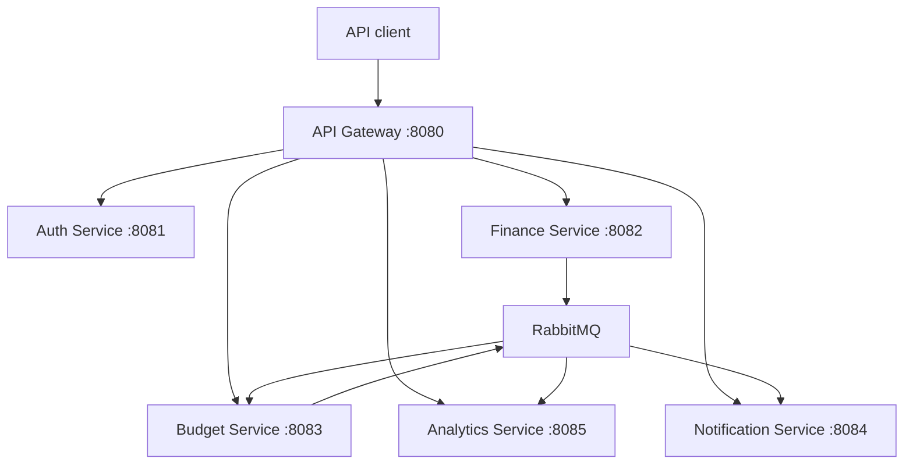

# SmartWallet

SmartWallet is a backend-focused personal finance system built with Java and Spring Boot. It uses independently deployable services for authentication, core financial operations, budgets, notifications, and analytics, exposed through a single API Gateway.

The project is primarily an exploration of microservice boundaries and data consistency: operations that must remain atomic live together, while derived capabilities are updated asynchronously through domain events.

## Highlights

- Account, category, transaction, and transfer management
- RSA-signed JWT authentication with refresh-token rotation
- Idempotent money transfers and balance validation
- Monthly and yearly spending analytics
- Category-based budgets and budget-exceeded notifications
- Transactional Outbox Pattern for reliable event publication
- Idempotent event consumers for safe redelivery
- Database-per-service architecture with Flyway migrations
- Docker Compose environment, health checks, CI, and an end-to-end test script

## Architecture



Each stateful service owns its PostgreSQL database. Services do not share tables or access one another's databases directly.

| Component | Responsibility | Port |
| --- | --- | ---: |
| API Gateway | Routing and JWT validation | 8080 |
| Auth Service | Registration, login, refresh tokens, and user identity | 8081 |
| Finance Service | Accounts, categories, transactions, transfers, and balances | 8082 |
| Budget Service | Category budgets and expense tracking | 8083 |
| Notification Service | User notifications generated from budget events | 8084 |
| Analytics Service | Read-optimized transaction projections and reports | 8085 |
| RabbitMQ | Asynchronous domain-event transport | 5672 |
| RabbitMQ Management | Local broker dashboard | 15672 |

## Service boundaries and consistency

The boundaries are based on transactional requirements rather than technical layers.

### Strict consistency in Finance Service

Accounts, transactions, transfers, and balances belong to the same consistency boundary. A financial operation can change multiple related records, and those changes must either commit together or fail together. For example, an account transfer must debit one account, credit another, and create the transfer record atomically. Keeping these concepts in one service and database allows Spring transactions and PostgreSQL ACID guarantees to protect financial invariants.

### Eventual consistency outside Finance Service

Budgets, analytics, and notifications are derived capabilities. A short delay before a new expense appears in a report or triggers a notification is acceptable, so these capabilities can be isolated and updated asynchronously.

Finance Service commits the financial change and an outbox record in the same local transaction. A scheduled publisher later sends the event to RabbitMQ. Budget and Analytics consume the event and update their own databases. Budget Service publishes a budget-exceeded event through its own outbox, which Notification Service consumes.

This design avoids distributed database transactions while preventing the classic failure where data is committed but its event is lost. Consumer-side processed-event records make event handling idempotent when RabbitMQ redelivers a message.

## Technology stack

- Java 21
- Spring Boot 4.1
- Spring Security and OAuth2 Resource Server
- Spring Cloud Gateway
- Spring Data JPA and Hibernate
- PostgreSQL 16
- RabbitMQ
- Flyway
- Docker and Docker Compose
- Maven Wrapper
- JUnit, Mockito, and Spring Boot Test
- GitHub Actions

## Getting started

### Prerequisites

- Docker with Docker Compose
- OpenSSL
- Bash
- `curl` and Python 3 only if you want to run the E2E test

### 1. Generate local JWT keys

From the repository root:

```bash
chmod +x scripts/generate-jwt-keys.sh
./scripts/generate-jwt-keys.sh
```

The private key is mounted only into Auth Service. The public key is shared with the gateway and protected services so they can verify tokens without being able to issue them.

### 2. Start the complete stack

```bash
docker compose up --build -d
```

Wait until every container is healthy:

```bash
docker compose ps
```

The API is available through the gateway at `http://localhost:8080`. RabbitMQ Management is available at `http://localhost:15672` with the local credentials `smartwallet` / `smartwallet`.

### 3. Run the end-to-end test

```bash
chmod +x scripts/e2e-test.sh
./scripts/e2e-test.sh
```

The script exercises the system through the gateway, including authentication, financial operations, event-driven analytics and notifications, transfer idempotency, and account archival rules.

### 4. Stop the stack

```bash
docker compose down
```

To also delete local database and RabbitMQ volumes:

```bash
docker compose down -v
```

## API overview

All application endpoints are exposed through `http://localhost:8080`.

| Area | Base path | Main operations |
| --- | --- | --- |
| Authentication | `/api/auth` | Register, login, refresh, logout |
| Current user | `/api/users/me` | Retrieve authenticated user |
| Accounts | `/api/accounts` | Create, list, update, archive, restore |
| Categories | `/api/categories` | Create and query categories |
| Transactions | `/api/transactions` | Create, filter, update, delete |
| Transfers | `/api/transfers` | Create and filter account transfers |
| Budgets | `/api/budgets` | Create, query, update, delete |
| Notifications | `/api/notifications` | List, read, mark as read, unread count |
| Analytics | `/api/analytics` | Monthly, category, trend, comparison, yearly reports |

Protected endpoints require an access token:

```http
Authorization: Bearer <access-token>
```

Transfer creation also supports an `Idempotency-Key` header so retrying the same request does not move money twice.

## Testing and CI

Run the test suite of an individual service with its Maven Wrapper:

```bash
cd finance-service
./mvnw clean verify
```

The GitHub Actions pipeline:

1. Builds and tests every service independently.
2. Validates the Docker Compose configuration.
3. Builds all Docker images.
4. Starts the stack and runs smoke/E2E checks.

## Repository structure

```text
smartwallet/
├── api-gateway/
├── auth-service/
├── finance-service/
├── budget-service/
├── notification-service/
├── analytics-service/
├── scripts/
├── .github/workflows/
└── docker-compose.yml
```

## Current scope

SmartWallet currently focuses on backend architecture and API behavior. A user-facing web or mobile client is not included yet.

## Author

Developed by Mert Dikdaş as a portfolio project focused on Java backend development, microservice boundaries, reliable messaging, and consistency trade-offs.
