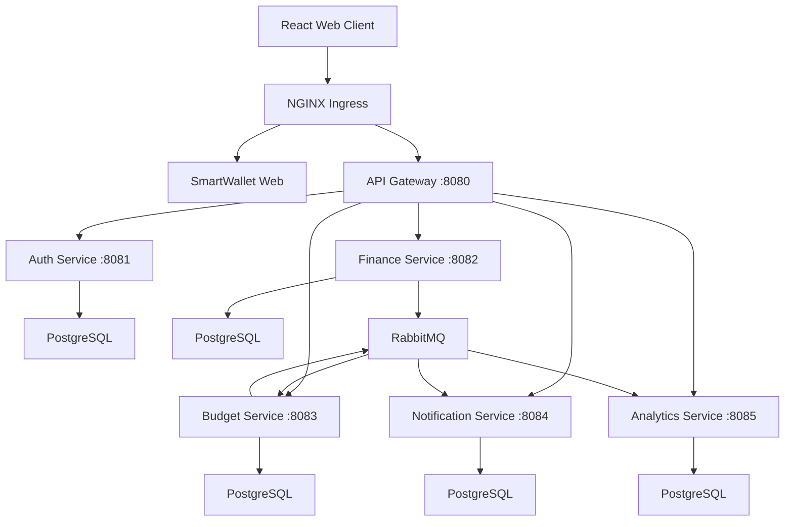

# SmartWallet

SmartWallet is a full-stack personal finance system built with Java, Spring Boot, React, and TypeScript. It uses independently deployable microservices for authentication, core financial operations, budgets, notifications, and analytics, exposed through a single API Gateway.

The project explores microservice boundaries, data consistency, asynchronous communication, containerization, and Kubernetes orchestration. Operations that must remain atomic live together, while derived capabilities are updated asynchronously through domain events.

## Highlights

- React + TypeScript web application
- Account, category, transaction, and transfer management
- RSA-signed JWT authentication with refresh-token rotation
- Idempotent money transfers and balance validation
- Monthly and yearly spending analytics
- Category-based budgets and budget-exceeded notifications
- Transactional Outbox Pattern for reliable event publication
- Idempotent event consumers for safe redelivery
- Database-per-service architecture with Flyway migrations
- RabbitMQ-based asynchronous communication
- Docker Compose development environment
- Kubernetes deployment with Minikube
- NGINX Ingress for application routing
- Horizontal Pod Autoscaling for Finance Service
- Container images published to GitHub Container Registry (GHCR)
- Automated local Kubernetes deployment script
- GitHub Actions CI and container image publishing
- End-to-end integration testing

## Architecture



Each stateful service owns its PostgreSQL database. Services do not share tables or access one another's databases directly.

| Component | Responsibility | Port |
| --- | --- | ---: |
| SmartWallet Web | React + TypeScript frontend | 80 |
| API Gateway | Routing and JWT validation | 8080 |
| Auth Service | Registration, login, refresh tokens, and user identity | 8081 |
| Finance Service | Accounts, categories, transactions, transfers, and balances | 8082 |
| Budget Service | Category budgets and expense tracking | 8083 |
| Notification Service | User notifications generated from budget events | 8084 |
| Analytics Service | Read-optimized transaction projections and reports | 8085 |
| RabbitMQ | Asynchronous domain-event transport | 5672 |
| RabbitMQ Management | Local broker dashboard | 15672 |

## Service boundaries and consistency

The boundaries are based on transactional requirements rather than technical layers.

### Strict consistency in Finance Service

Accounts, transactions, transfers, and balances belong to the same consistency boundary. A financial operation can change multiple related records, and those changes must either commit together or fail together.

For example, an account transfer must debit one account, credit another, and create the transfer record atomically. Keeping these concepts in one service and database allows Spring transactions and PostgreSQL ACID guarantees to protect financial invariants.

### Eventual consistency outside Finance Service

Budgets, analytics, and notifications are derived capabilities. A short delay before a new expense appears in a report or triggers a notification is acceptable, so these capabilities can be isolated and updated asynchronously.

Finance Service commits the financial change and an outbox record in the same local transaction. A scheduled publisher later sends the event to RabbitMQ. Budget and Analytics consume the event and update their own databases.

Budget Service publishes a budget-exceeded event through its own outbox, which Notification Service consumes.

This design avoids distributed database transactions while preventing the classic failure where data is committed but its event is lost. Consumer-side processed-event records make event handling idempotent when RabbitMQ redelivers a message.

## Technology stack

### Backend

- Java 21
- Spring Boot 4.1
- Spring Security
- OAuth2 Resource Server
- Spring Cloud Gateway
- Spring Data JPA
- Hibernate
- PostgreSQL 16
- RabbitMQ
- Flyway
- Maven

### Frontend

- React
- TypeScript
- Vite

### Infrastructure and DevOps

- Docker
- Docker Compose
- Kubernetes
- Minikube
- NGINX Ingress Controller
- Kubernetes Horizontal Pod Autoscaler
- GitHub Container Registry (GHCR)
- GitHub Actions

### Testing

- JUnit
- Mockito
- Spring Boot Test
- Bash-based end-to-end testing

---

# Running with Docker Compose

## Prerequisites

- Docker with Docker Compose
- OpenSSL
- Bash
- `curl` and Python 3 if you want to run the E2E test

## 1. Generate local JWT keys

From the repository root:

```bash
chmod +x scripts/generate-jwt-keys.sh
./scripts/generate-jwt-keys.sh
```

The private key is mounted only into Auth Service. The public key is shared with the gateway and protected services so they can verify tokens without being able to issue them.

## 2. Start the complete stack

```bash
docker compose up --build -d
```

Wait until every container is healthy:

```bash
docker compose ps
```

The API is available through the gateway at:

```text
http://localhost:8080
```

RabbitMQ Management is available at:

```text
http://localhost:15672
```

Local RabbitMQ credentials:

```text
Username: smartwallet
Password: smartwallet
```

## 3. Run the end-to-end test

```bash
chmod +x scripts/e2e-test.sh
./scripts/e2e-test.sh
```

The script exercises the system through the gateway, including authentication, financial operations, event-driven analytics and notifications, transfer idempotency, and account archival rules.

## 4. Stop the stack

```bash
docker compose down
```

To also delete local database and RabbitMQ volumes:

```bash
docker compose down -v
```

---

# Running with Kubernetes

SmartWallet can also run as a complete local Kubernetes environment using Minikube.

The Kubernetes setup includes:

- Deployments for all backend services
- React frontend deployment
- PostgreSQL deployments for stateful services
- RabbitMQ deployment
- PersistentVolumeClaims for persistent data
- ConfigMaps for application configuration
- Kubernetes Secrets for credentials and RSA keys
- NGINX Ingress
- Health probes
- Startup probes for slower-starting services
- Horizontal Pod Autoscaling for Finance Service

## Prerequisites

Install:

- Docker
- `kubectl`
- Minikube

Verify the installations:

```bash
docker --version
kubectl version --client
minikube version
```

## Container images

Application images are published to GitHub Container Registry:

```text
ghcr.io/mertdikdas/smartwallet-auth
ghcr.io/mertdikdas/smartwallet-finance
ghcr.io/mertdikdas/smartwallet-budget
ghcr.io/mertdikdas/smartwallet-notification
ghcr.io/mertdikdas/smartwallet-analytics
ghcr.io/mertdikdas/smartwallet-api-gateway
ghcr.io/mertdikdas/smartwallet-web
```

The Kubernetes deployments pull these images instead of requiring the application images to be built manually inside Minikube.

Multi-platform images are built for both:

```text
linux/amd64
linux/arm64
```

This allows the Kubernetes environment to run on both x86-64 systems and ARM-based machines such as Apple Silicon Macs.

## Automated local deployment

Generate the JWT keys first if they do not already exist:

```bash
chmod +x scripts/generate-jwt-keys.sh
./scripts/generate-jwt-keys.sh
```

Then make the deployment script executable:

```bash
chmod +x scripts/deploy-local.sh
```

Deploy the complete Kubernetes environment:

```bash
./scripts/deploy-local.sh
```

The script automatically:

1. Starts Minikube.
2. Enables the NGINX Ingress addon.
3. Enables Metrics Server.
4. Creates or updates Kubernetes Secrets.
5. Creates the JWT key Secrets.
6. Applies all Kubernetes manifests.
7. Waits for application deployments to become ready.
8. Displays the final Pod status.

A successful deployment ends with:

```text
SmartWallet local deployment completed.
```

Check the running workloads:

```bash
kubectl get pods
```

Inspect services:

```bash
kubectl get services
```

Inspect the Ingress:

```bash
kubectl get ingress
```

## Accessing SmartWallet on macOS

When Minikube uses the Docker driver on macOS, the Minikube node network is not directly reachable from the host.

Expose the NGINX Ingress Controller with:

```bash
minikube service ingress-nginx-controller \
  -n ingress-nginx \
  --url
```

Minikube prints local HTTP and HTTPS endpoints, for example:

```text
http://127.0.0.1:64073
http://127.0.0.1:64074
```

Keep that terminal open while accessing the application.

If `smartwallet.local` is configured in `/etc/hosts`:

```text
127.0.0.1 smartwallet.local
```

the application can be accessed using the HTTP port returned by Minikube:

```text
http://smartwallet.local:<HTTP_PORT>
```

The exact port may change whenever the Minikube service tunnel is restarted.

## Horizontal Pod Autoscaling

Finance Service uses a Kubernetes HorizontalPodAutoscaler.

Inspect its current state with:

```bash
kubectl get hpa
```

The HPA can automatically change the number of Finance Service replicas according to resource utilization.

This demonstrates horizontal scaling without manually creating or deleting application Pods.

## Health management

Kubernetes uses readiness and liveness probes to determine whether services can receive traffic and whether they are healthy.

Services with longer startup times can additionally use a `startupProbe`. This prevents Kubernetes from restarting a Spring Boot application before it has completed initialization.

For example, Notification Service may require additional startup time while initializing Spring, Hibernate, PostgreSQL connections, Flyway migrations, and RabbitMQ connectivity.

---

# CI and container publishing

SmartWallet uses GitHub Actions for continuous integration and container publishing.

## Continuous Integration

The CI workflow:

1. Builds and tests every backend service independently.
2. Generates temporary RSA keys for tests.
3. Validates the Docker Compose configuration.
4. Builds the Docker images.
5. Starts the complete stack.
6. Checks service health endpoints.
7. Runs the end-to-end flow.
8. Collects container logs if a failure occurs.
9. Shuts the environment down after testing.

The workflow is defined in:

```text
.github/workflows/ci.yml
```

## Container publishing

The image publishing workflow builds application containers and publishes them to GitHub Container Registry.

Images are tagged using both:

```text
latest
```

and a commit-specific SHA tag:

```text
sha-<commit>
```

The workflow publishes images for:

- Auth Service
- Finance Service
- Budget Service
- Notification Service
- Analytics Service
- API Gateway
- SmartWallet Web

Images are built for both AMD64 and ARM64 so the same registry images can be consumed by Kubernetes environments running on different processor architectures.

The workflow is defined in:

```text
.github/workflows/publish-images.yml
```

---

# API overview

All backend application endpoints are exposed through the API Gateway.

| Area | Base path | Main operations |
| --- | --- | --- |
| Authentication | `/api/auth` | Register, login, refresh, logout |
| Current user | `/api/users/me` | Retrieve authenticated user |
| Accounts | `/api/accounts` | Create, list, update, archive, restore |
| Categories | `/api/categories` | Create and query categories |
| Transactions | `/api/transactions` | Create, filter, update, delete |
| Transfers | `/api/transfers` | Create and filter account transfers |
| Budgets | `/api/budgets` | Create, query, update, delete |
| Notifications | `/api/notifications` | List, read, mark as read, unread count |
| Analytics | `/api/analytics` | Monthly, category, trend, comparison, yearly reports |

Protected endpoints require an access token:

```http
Authorization: Bearer <access-token>
```

Transfer creation also supports an `Idempotency-Key` header so retrying the same request does not move money twice.

---

# Repository structure

```text
smartwallet/
├── api-gateway/
├── auth-service/
├── finance-service/
├── budget-service/
├── notification-service/
├── analytics-service/
├── smartwallet-web/
│
├── k8s/
│   ├── analytics/
│   ├── api-gateway/
│   ├── auth/
│   ├── budget/
│   ├── finance/
│   ├── frontend/
│   ├── notification/
│   └── rabbitmq/
│
├── scripts/
│   ├── deploy-local.sh
│   ├── e2e-test.sh
│   └── generate-jwt-keys.sh
│
├── .github/
│   └── workflows/
│       ├── ci.yml
│       └── publish-images.yml
│
└── docker-compose.yml
```

# Deployment architecture

SmartWallet currently supports two local deployment models:

```text
Development / Integration
        │
        └── Docker Compose
              │
              ├── Backend microservices
              ├── PostgreSQL
              └── RabbitMQ


Kubernetes Environment
        │
        └── Minikube
              │
              ├── NGINX Ingress
              ├── React frontend
              ├── API Gateway
              ├── Backend microservices
              ├── PostgreSQL
              ├── RabbitMQ
              ├── Persistent storage
              └── Horizontal Pod Autoscaling
```

Application container images are built by GitHub Actions and stored in GHCR, allowing Kubernetes to pull prebuilt images independently of the developer machine.
---

# Monitoring and observability

SmartWallet includes a monitoring stack based on Prometheus and Grafana running inside the local Kubernetes environment.

Finance Service exposes application and JVM metrics through Spring Boot Actuator and Micrometer at:

```text
/actuator/prometheus
```

Prometheus periodically scrapes these metrics through Kubernetes internal DNS. The scrape configuration is stored in:

```text
k8s/monitoring/prometheus-values.yaml
```

Prometheus can be accessed locally with:

```bash
kubectl port-forward -n monitoring svc/prometheus-server 9090:80
```

Grafana uses Prometheus as its data source and provides dashboards for:

- CPU utilization
- JVM heap memory usage
- HTTP request rate
- Active database connections

Grafana can be accessed locally with:

```bash
kubectl port-forward -n monitoring svc/grafana 3000:80
```

## Autoscaling validation

Finance Service uses a Kubernetes HorizontalPodAutoscaler configured with:

- Minimum replicas: `1`
- Maximum replicas: `5`
- Target CPU utilization: `60%`

Autoscaling was validated by generating continuous traffic against Finance Service:

```bash
kubectl run load-generator \
  --image=busybox:1.36 \
  --restart=Never \
  -- /bin/sh -c \
  'while true; do wget -q -O- http://finance-service:8082/actuator/health >/dev/null; done'
```

The HPA was monitored with:

```bash
kubectl get hpa finance-service -w
```

During the load test, CPU utilization exceeded the configured `60%` target and reached `100%`. Kubernetes automatically scaled Finance Service from `1` to `2` replicas.

After the workload was distributed across the replicas, average CPU utilization decreased below the target.

The load test was also observed through Grafana, providing visibility into:

- CPU utilization
- HTTP request rate
- JVM memory usage
- Active database connections

The load generator can be removed after testing with:

```bash
kubectl delete pod load-generator
```

The monitoring and autoscaling flow is:

```text
Finance Service
      │
      │ Micrometer / Actuator
      ▼
Prometheus
      │
      ▼
Grafana


Metrics Server
      │
      ▼
Horizontal Pod Autoscaler
      │
      ▼
Finance Service replicas
```

---

# Current scope

SmartWallet currently provides a complete local full-stack environment with a React web client, Spring Boot microservices, asynchronous messaging, independent databases, automated CI, container publishing, and Kubernetes orchestration.

The Kubernetes deployment currently targets Minikube for local development and demonstration rather than a continuously running public cloud cluster.

# Author

Developed by Mert Dikdaş as a portfolio project focused on Java backend development, microservice architecture, reliable messaging, consistency trade-offs, containerization, CI/CD, and Kubernetes.