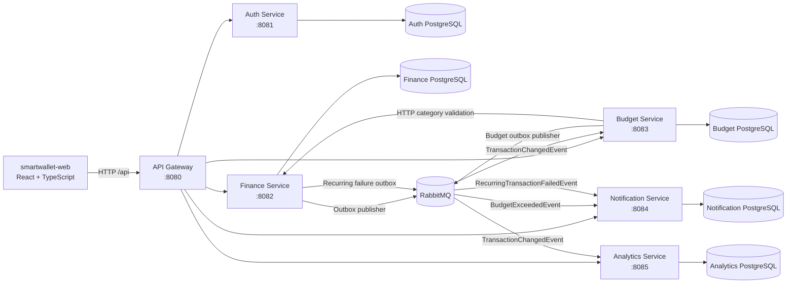
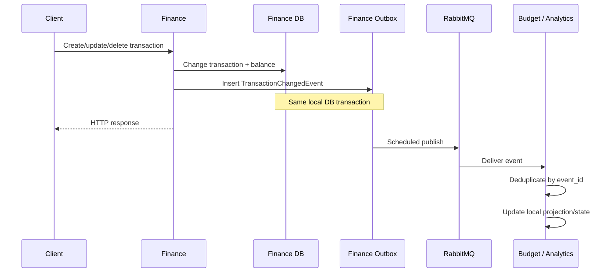
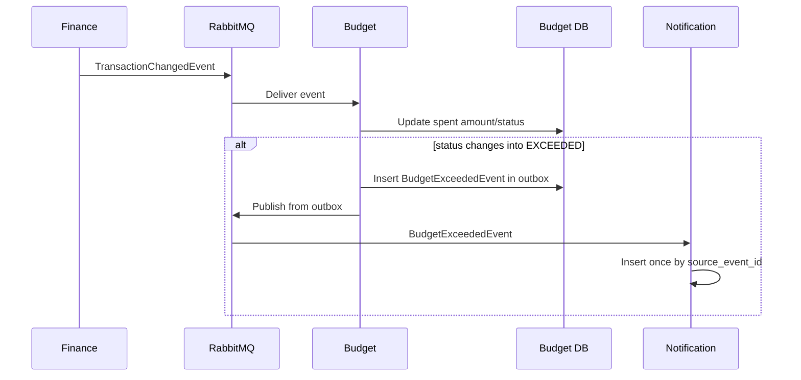
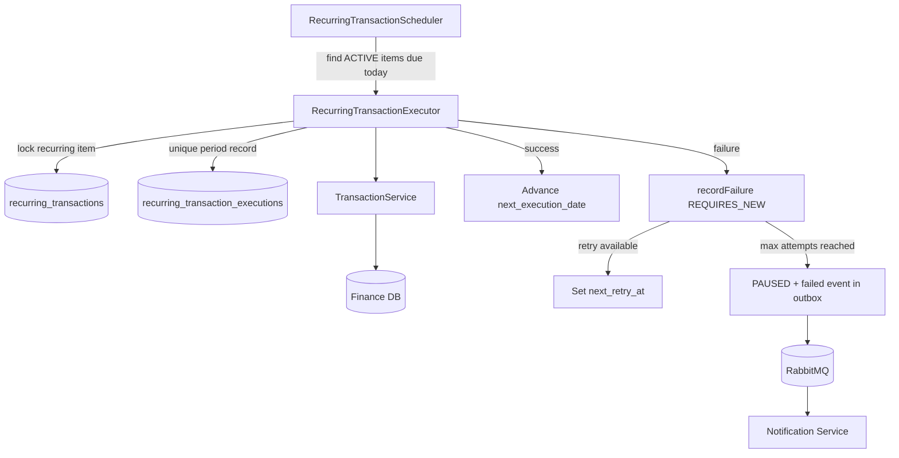
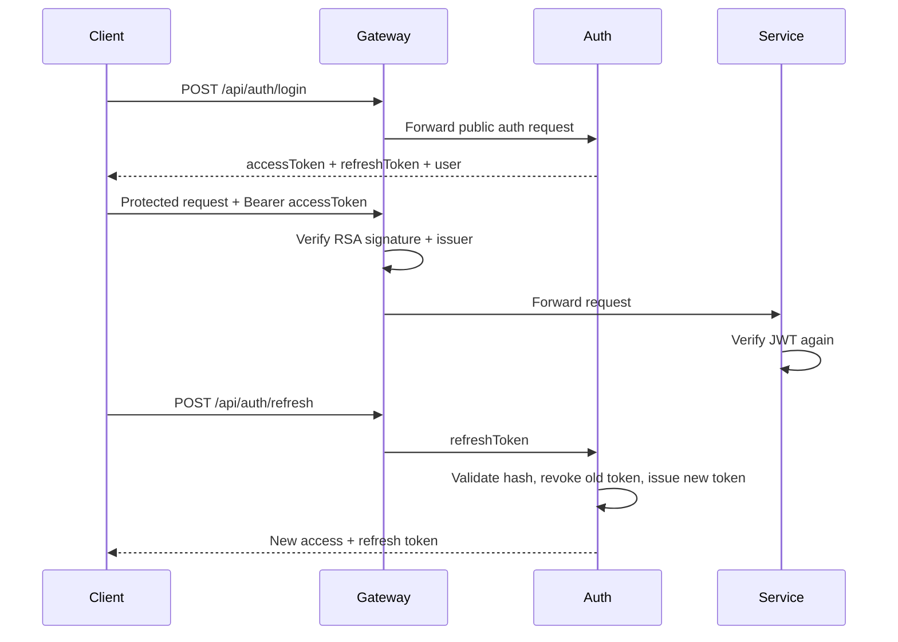

# SmartWallet Architecture

## 1. Purpose

SmartWallet separates strict financial consistency from derived capabilities. Financial state that must change atomically is owned by Finance Service. Budgeting, analytics, and notifications are isolated services that can accept eventual consistency and are updated through domain events.

The repository also contains a React/TypeScript web client that talks to the backend through API Gateway.

## 2. System context

## 3. Component responsibilities

### API Gateway

API Gateway is the external backend entry point.

It:

- listens on port `8080`;
- routes `/api/auth/**` and `/api/users/**` to Auth;
- routes account, category, transaction, transfer, and recurring-transaction APIs to Finance;
- routes `/api/budgets/**` to Budget;
- routes `/api/notifications/**` to Notification;
- routes `/api/analytics/**` to Analytics;
- validates JWTs for protected requests.

The gateway is routing/security infrastructure, not a business-logic layer.

### Auth Service

Auth owns user identity and token lifecycle.

It owns:

- users;
- BCrypt password hashes;
- refresh-token hashes;
- login authentication;
- RSA-signed access-token issuance;
- refresh-token rotation and revocation.

Only Auth receives the JWT private key.

### Finance Service

Finance is the strict financial consistency boundary and the source of truth for:

- accounts and balances;
- account archive/restore state;
- categories;
- financial transactions;
- transfers;
- recurring transaction schedules;
- recurring execution history;
- Finance outbox events.

Financial mutations and their balance effects are committed in local PostgreSQL transactions.

### Budget Service

Budget owns monthly category budgets and their derived spending state.

It:

- validates that a new budget references a user-owned `EXPENSE` category through Finance;
- keeps one budget per user/category/year/month;
- consumes transaction events;
- adjusts `spent_amount` as transaction state changes;
- changes budget status between `ACTIVE` and `EXCEEDED`;
- emits `BudgetExceededEvent` through its own outbox when a budget newly crosses into exceeded state.

### Analytics Service

Analytics is a read model built from Finance transaction events.

It owns transaction projections and provides:

- monthly totals;
- monthly category analytics;
- monthly trend reports;
- month-to-month comparison;
- yearly analytics.

Analytics does not query the Finance database to produce reports.

### Notification Service

Notification owns user notification state.

It currently creates notifications from:

- `BudgetExceededEvent`;
- `RecurringTransactionFailedEvent`.

Notifications are deduplicated by source event ID.

### smartwallet-web

The frontend is a React/TypeScript Vite application.

Current source structure includes:

- authentication pages and API integration;
- session storage and automatic access-token refresh;
- protected routes;
- dashboard/account UI;
- transaction creation/history APIs and UI.

During local development, Vite proxies `/api` to API Gateway on port `8080`.

## 4. Data ownership

| Data | Owner | Other services may access it by |
| --- | --- | --- |
| Users, password hashes, refresh tokens | Auth | JWT identity / Auth API |
| Accounts and balances | Finance | Finance API / events containing needed facts |
| Categories | Finance | Finance API / transaction event snapshots |
| Transactions | Finance | Transaction events / Finance API |
| Transfers | Finance | Finance API |
| Recurring schedules/executions | Finance | Finance API / failure events |
| Budgets | Budget | Budget API / budget events |
| Notifications | Notification | Notification API |
| Transaction projections/reports | Analytics | Analytics API |

No service should directly read or write another service's PostgreSQL database.

## 5. Consistency model

### Strict consistency inside Finance

Accounts, transactions, transfers, and balances are coupled by invariants.

Examples:

- creating an `INCOME` transaction increases the selected account balance;
- creating an `EXPENSE` transaction decreases it;
- updating a transaction reverses its old balance effect and applies the new one;
- deleting a transaction reverses its balance effect;
- a transfer debits one account and credits another in the same local transaction.

These operations remain in one service and one database so Spring transactions and PostgreSQL ACID semantics can protect them.

### Eventual consistency outside Finance

Budget and Analytics are derived from transactions and are updated asynchronously. Notification is derived from domain events. A short delay is acceptable for these capabilities, so they do not participate in Finance database transactions.

This avoids distributed transactions and preserves independent data ownership.

## 6. Reliable event publication

Finance and Budget use the Transactional Outbox Pattern.

For a Finance transaction change:

The business write and outbox insert commit together. Event publication can be retried after commit without losing the event.

Outbox publisher delay is currently `2000 ms` in Finance and Budget configuration.

## 7. Transaction event consumers

### Budget

Budget stores processed transaction event IDs before/while applying event effects so duplicate deliveries do not repeatedly modify `spent_amount`.

### Analytics

Analytics also stores processed event IDs and maintains its local transaction projection.

The architecture assumes RabbitMQ delivery may be repeated. Consumers therefore must remain idempotent.

## 8. Budget-exceeded flow

A budget-exceeded event is produced only when the status transitions into `EXCEEDED`, rather than on every later transaction while already exceeded.

## 9. Recurring-transaction execution

Finance owns scheduling and execution.

Important protections:

- scheduler batch size: `50`;
- schedule clock uses UTC dates;
- one execution record per `(recurring_transaction_id, scheduled_date)`;
- executor runs in `REQUIRES_NEW`;
- failure-history write also runs in `REQUIRES_NEW`;
- retries are configuration-driven;
- maximum failures pause the schedule and notify the user asynchronously.

Local Docker Compose overrides the recurring scheduler/retry delays to small values for E2E testing.

## 10. Authentication flow

Access tokens currently expire after 15 minutes. Refresh tokens expire after 7 days and are rotated on use.

## 11. Local topology

| Component | Host port |
| --- | ---: |
| API Gateway | 8080 |
| Auth | 8081 |
| Finance | 8082 |
| Budget | 8083 |
| Notification | 8084 |
| Analytics | 8085 |
| Auth PostgreSQL | 5433 |
| Finance PostgreSQL | 5434 |
| Budget PostgreSQL | 5435 |
| Notification PostgreSQL | 5436 |
| Analytics PostgreSQL | 5437 |
| RabbitMQ AMQP | 5672 |
| RabbitMQ Management | 15672 |
| Vite frontend | 5173 by default |

The backend stack is started by root `docker-compose.yml`. The frontend currently runs separately with Vite.

## 12. Architectural constraints

The following are deliberate architectural choices, not accidental implementation details:

- database per service;
- Finance as the atomic money boundary;
- asynchronous projections for Budget and Analytics;
- notification creation from events;
- outbox-based reliable publication;
- idempotent consumers;
- RSA JWT verification at the gateway and protected services;
- transfer idempotency plus database uniqueness;
- explicit locking/uniqueness around concurrent financial operations.

Changes to these constraints should be recorded as a new ADR under `docs/adr/`.
